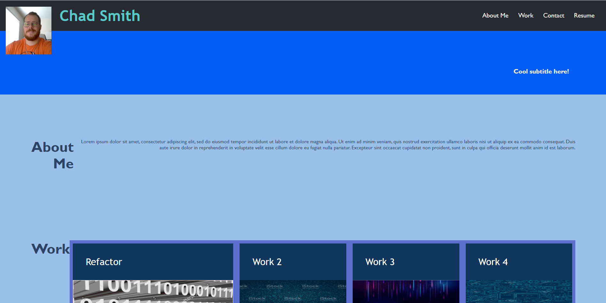

# Portfolio Challenge

## Description

Write code from scratch to make a webpage for a personal portoflio and complete the below items:

- The portfolio should have the developer's name, a recent photo or avatar, and links to sections about them, their work, and how to contact them
- When clicking on the links the UI scrolls to the corresponding section
- When clicking on the link to the seciotn about their work the UI scrolls to a section with titled images of the developer's applications
- When presented with the developer's first application that application's image should be larger in size than the others
- When clicking on the image of the application, you are taken to that deployed application
- When resizing the page or view of the site you are presented with a responsive layout that adapts to my viewport

## Usage

To provide a portfolio for the developer to provide example of their work

## Credits

N/A

## License

Please refer to the LICENSE in the repo.